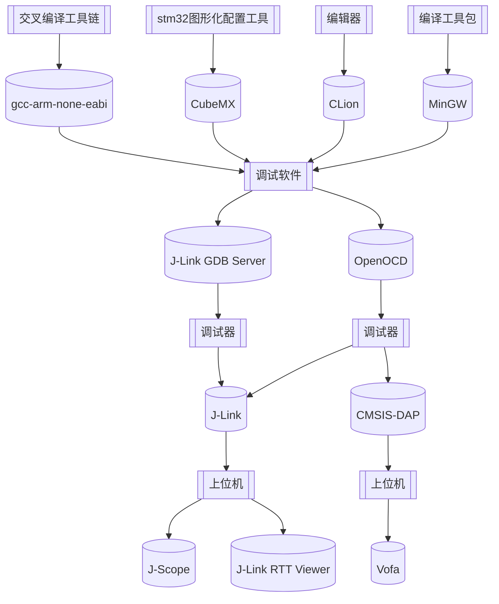

   


## 简介

交叉编译链 gcc-arm-none-eabi 的作用，是将文件编译成 arm 架构下的文件格式，如 `elf, axf, bin`，从而供主控板使用。

>`gcc-arm-none-eabi`可以从 ARM 官网上安装，也可以使用 ST 公司提供的 STM32CubeCLT 安装后捆绑 `gcc-arm-none-eabi`，或者如果安装过 STM32CubeIDE 的话，在安装目录下也会捆绑 `gcc-arm-none-eabi`。

编译工具包 MinGW 提供了 gcc、cmake 等工具，其安装是 ==可选项== ，因为 CLion 捆绑了 MinGW-w64 版本。

OpenOCD 和 JLinkGDBServer 都属于 GDB Server。OpenOCD 支持 J-Link、ST-Link、CMSIS-DAP（无线调试器） 等多种调试器，但是配置流程稍显复杂。

>我使用的是 STM32CubeCLT + MinGW( CLion 捆绑 ) + OpenOCD 的调试方案。

如果构建时速度慢，极大概率是因为杀毒软件，点名批评 Windows 的微软电脑管家，这条适用于所有 IDE

----
## 软件下载

### CLion

- 注册 JetBrains 账号，进行学信网认证，即可免费使用全部 JetBrains 系列软件
- CLion 现在非商用免费了，不使用教育认证也能用
- [CLion官网](https://www.jetbrains.com/clion/)下载安装包，使用 JetBrains 账号登录即可
- ==安装时可选的 Options 全都勾上==


### CubeMX

- [STM32CubeMX官网](https://www.st.com/en/development-tools/stm32cubemx.html)下载安装包
- ST 的安装目录建议都为根目录下，如安装在 C 盘 `C:\ST\`，这样方便查找

### STM32CubeCLT
- [STM32CubeCLT官网](https://www.st.com.cn/zh/development-tools/stm32cubeclt.html)下载安装包
- 建议安装 STM32CubeCLT ，因为捆绑的比较齐全

### Arm GNU Toolchain 

>STM32CubeCLT 与 Arm GNU Toolchain 选择其一安装即可，软件名字 ~~gcc-arm-none-eabi~~ 已被弃用，现在的名字为 Arm GNU Toolchain，安装后还是`gcc-arm-none-eabi`

- [Arm GNU Toolchain 官网](https://developer.arm.com/downloads/-/arm-gnu-toolchain-downloads)
- 建议下载`.exe`安装包，这样安装程序会自动配置 __环境变量__，而使用压缩包需要自行配置环境变量
- 可自行修改安装路径

### J-Link

- [J-Link官网](https://www.segger.com/downloads/jlink/)下载V7及以上版本，会附带 J-Scope、JLinkGDBServer等重要工具

### OpenOCD

- [OpenOCD官网](https://link.zhihu.com/?target=https%3A//gnutoolchains.com/arm-eabi/openocd/)下载安装包
- 文件夹 ==不可放置在有空格的路径下==（如`Program Files`），可直接放置在C盘根目录下

### MinGW（可选）

- [MinGW官网](https://bit.ly/mingw10)下载安装包
- 默认安装在C盘`Program Files`目录下，可自行修改路径

## 环境配置

- 搜索 "环境变量" --> "编辑系统环境变量" --> "环境变量" --> "Path" --> "编辑" --> "新建"
- 因为STM32CubeCLT 安装时已自动添加环境变量，所以只需要添加 OpenOCD 安装目录下的`bin`目录即可


- 比如我的 OpenOCD 安装目录为 `"C:\OpenOCD-20240916-0.12.0"`，则添加 `C:\OpenOCD-20240916-0.12.0\bin` 


- 在终端测试是否安装成功

```powershell
  openocd -v            # openocd
```
## CLion 配置

- 中文设置


- 路径配置


- 工具链配置

更改 C 编译器，C++ 编译器为 STM32CubeCLT 安装目录下的 `GNU-tools-for-STM32\bin` 目录下的 `arm-none-eabi-gcc.exe` 和 `arm-none-eabi-g++.exe`


- CMake 配置

工具链选择修改过编译器的工具链，生成器改为 ninja，ninja 构建比较快


## 烧录
### OpenOCD

OpenOCD需要配置 .cfg 文件，~~自动选择的好像不行~~ 下面分享我使用的配置

=== "stm32f4_daplink.cfg"

    ```c
    source [find interface/cmsis-dap.cfg]
    
    transport select swd
    
    # increase working area to 64KB
    set WORKAREASIZE 0x10000
    
    source [find target/stm32f4x.cfg]
    
    reset_config none
    ```

=== "stm32f4_stlink.cfg"

    ```c
    source [find interface/stlink.cfg]
    
    transport select hla_swd
    
    # increase working area to 64KB
    set WORKAREASIZE 0x10000
    
    source [find target/stm32f4x.cfg]
    
    reset_config none
    
    ```
=== "stm32f1_daplink.cfg"

    ```c
    source [find interface/cmsis-dap.cfg]
    
    transport select swd
    
    source [find target/stm32f1x.cfg]
    
    reset_config none
    ```

=== "stm32f1_stlink.cfg"

    ```c
    source [find interface/stlink.cfg]
    
    transport select hla_swd
    
    source [find target/stm32f1x.cfg]
    
    reset_config none
    
    ```

----
在初始化锁相环的时候会出现卡死的情况，原因是 HAL 库与 OpenOCD 对时钟的配置所导致，具体原因见[OpenOCD在debug时PLL卡死问题](https://blog.t123yh.xyz:2/index.php/archives/922)。

解决方案：

- 在单片机进入 main 函数时，把系统时钟来源设为 HSI。(推荐)
  
```c
int main(void)
{
    __HAL_RCC_HSI_ENABLE();
    __HAL_RCC_SYSCLK_CONFIG(RCC_SYSCLKSOURCE_HSI);
    HAL_Init();
    SystemClock_Config();
}  
```

- 或者将 main 文件中的 SystemClock_Config 函数作如下修改。

```c
void SystemClock_Config(void)
{
    RCC_OscInitTypeDef RCC_OscInitStruct = {0};
    RCC_ClkInitTypeDef RCC_ClkInitStruct = {0};

    /** Configure the main internal regulator output voltage
    */
    __HAL_RCC_PWR_CLK_ENABLE();
    __HAL_PWR_VOLTAGESCALING_CONFIG(PWR_REGULATOR_VOLTAGE_SCALE1);

    // 先将时钟源选择为内部时钟
    RCC_ClkInitStruct.ClockType = RCC_CLOCKTYPE_SYSCLK;
    RCC_ClkInitStruct.SYSCLKSource = RCC_SYSCLKSOURCE_HSI;
    if (HAL_RCC_ClockConfig(&RCC_ClkInitStruct, FLASH_LATENCY_5) != HAL_OK)
    {
        Error_Handler();
    }

    // 初始化锁相环
    RCC_OscInitStruct.OscillatorType = RCC_OSCILLATORTYPE_HSE;
    RCC_OscInitStruct.HSEState = RCC_HSE_ON;
    RCC_OscInitStruct.PLL.PLLState = RCC_PLL_ON;
    RCC_OscInitStruct.PLL.PLLSource = RCC_PLLSOURCE_HSE;
    RCC_OscInitStruct.PLL.PLLM = 6;
    RCC_OscInitStruct.PLL.PLLN = 168;
    RCC_OscInitStruct.PLL.PLLP = RCC_PLLP_DIV2;
    RCC_OscInitStruct.PLL.PLLQ = 4;
    if (HAL_RCC_OscConfig(&RCC_OscInitStruct) != HAL_OK)
    {
        Error_Handler();
    }

    // 锁相环已经初始化完毕了，将时钟源在切换回外部时钟源
    RCC_ClkInitStruct.ClockType = RCC_CLOCKTYPE_HCLK|RCC_CLOCKTYPE_SYSCLK
                                  |RCC_CLOCKTYPE_PCLK1|RCC_CLOCKTYPE_PCLK2;
    RCC_ClkInitStruct.SYSCLKSource = RCC_SYSCLKSOURCE_PLLCLK;
    RCC_ClkInitStruct.AHBCLKDivider = RCC_SYSCLK_DIV1;
    RCC_ClkInitStruct.APB1CLKDivider = RCC_HCLK_DIV4;
    RCC_ClkInitStruct.APB2CLKDivider = RCC_HCLK_DIV2;
    if (HAL_RCC_ClockConfig(&RCC_ClkInitStruct, FLASH_LATENCY_5) != HAL_OK)
    {
        Error_Handler();
    }

    // 禁用内部高速时钟
    RCC_OscInitStruct.OscillatorType = RCC_OSCILLATORTYPE_HSI;
    RCC_OscInitStruct.HSIState = RCC_HSI_OFF;
    RCC_OscInitStruct.PLL.PLLState = RCC_PLL_NONE;
    if(HAL_RCC_OscConfig(&RCC_OscInitStruct) != HAL_OK)
    {
        Error_Handler();
    }
}
```

----


