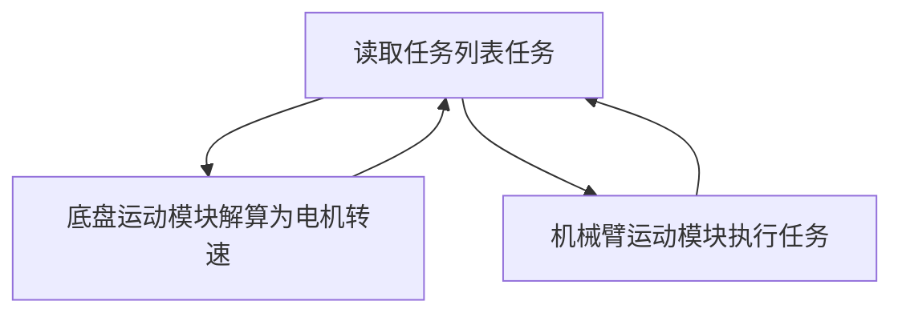

本人代码水平有限，使用的代码改于开源代码，且因为代码注释不全、运行效率不高，所以代码不全放出，只放出关键的底层驱动代码，和一部分算法，请借鉴更优秀的开源代码。

>如果构建时速度慢，极大概率是因为杀毒软件，点名批评 Windows 的微软电脑管家，这条适用于所有 IDE。OpenOCD 下载卡死问题请查阅 CLion 配置 OpenOCD 章节

我的整个代码框架为裸机任务索引类型，即主循环不断读取任务列表，分配给相应执行函数执行对应任务，任务完成后到位标志位为真，任务列表运行下一个任务，如下图所示：

---