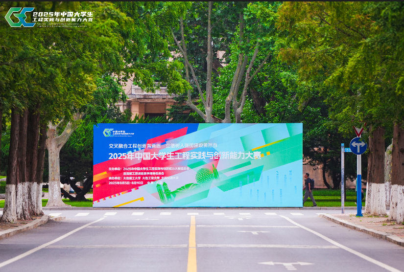

从比赛名称就能看出，它主要考察 **工程实践** 与 **创新能力**，强调团队协作与临场应变
。一方面考验初赛时的稳定发挥与对场地的适应能力，另一方面在决赛的社区赛中，则要求在有限时间内完成新命题的解决。

比赛并非单一能力的比拼，而是 **多学科交叉融合** 的整体考察。团队成员必须互相了解、相互支撑，比如：

* 机械同学的电机选型是否满足软件对精度的要求；
* 硬件设计是否考虑了软件实现的需要。

项目必须整体规划，而不是各自为战。

在备赛过程中，**调试时间必须充足**。现场环境与工作室差异很大，问题不可预期，必须提前准备应对方案，避免现场慌乱
。例如：若现场地面打滑，应准备快速解决措施。

此外，比赛前仅有 **三分钟调试时间**，实际非常紧张。此时不宜大范围修改，只需验证关键功能即可
。比如：只测试扫码、抓取、放置等核心环节，跑半圈即可，不必全程运行。

---

